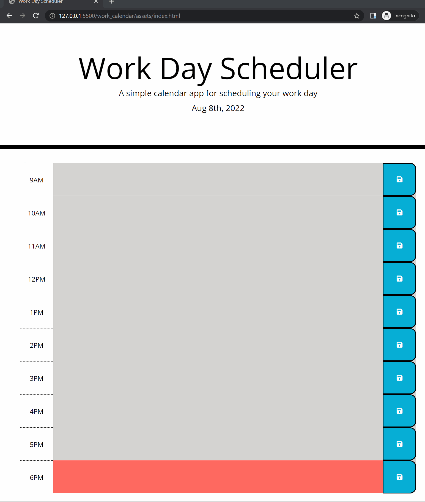

# UCI Coding Bootcamp
## Work Day Calendar

### Decription
Keep track of your day with this basic time slot/meeting tracker 

### Installation
Link to the deployed application can be found [here](https://sdanielewicz.github.io/work_calendar/ "Work Day Calendar").

### Usage
Navigte to the deployed project. In the given text area type your event. Grey event means past. Red means now. Green means future. Click the save button to save your event to that slot. when you return from the page you can reload it and your events will still be there

### Features
* Webpage keeps time
* Dynamic display of work day hours with color key for past present and future
* Ability to save the events you enter and they will still be there if the webpage is reloaded

### TODO
* get rid of all those very WET repetitve event listenrs
